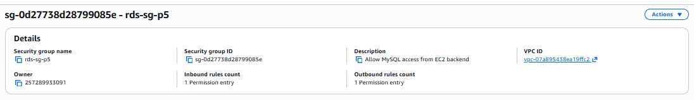
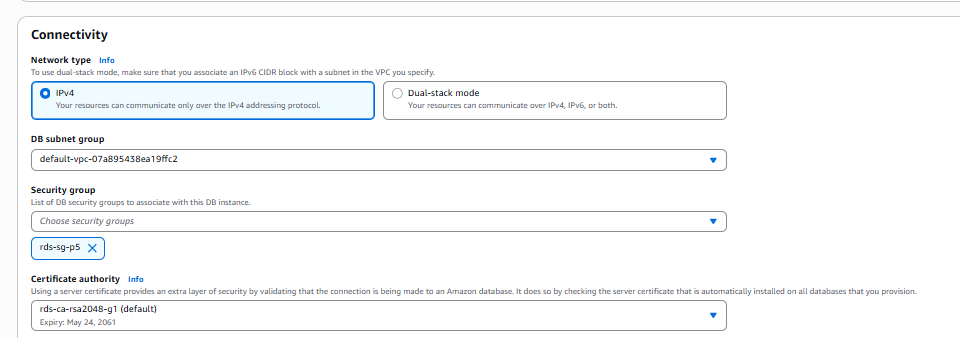
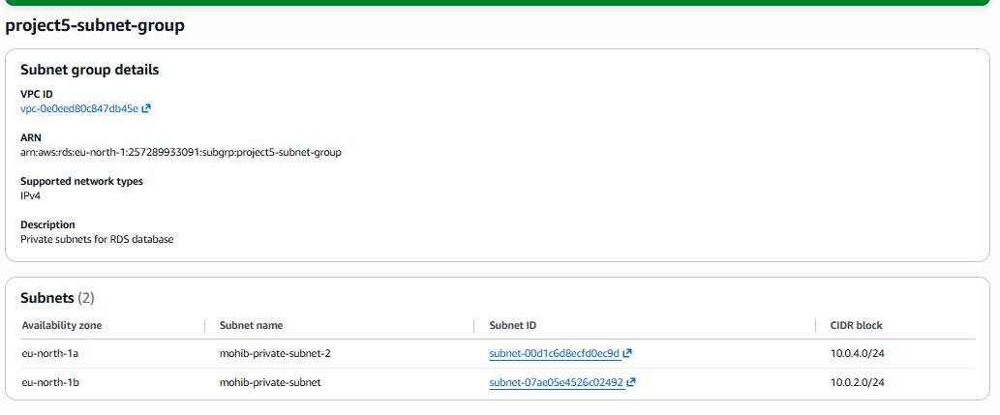
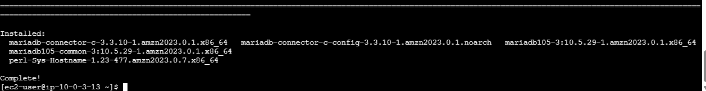
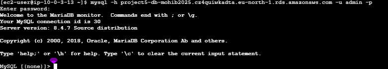
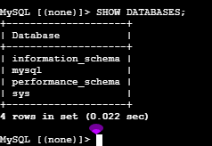

# 🚀 AWS Project 5 – RDS Database Integration

In this project, I extended my previous AWS architecture by adding a database layer using Amazon RDS (MySQL).

The main goal was to understand how backend EC2 instances can communicate securely with a managed database inside the same VPC.

This project was built on top of Project 4 (Load Balancer + Auto Scaling).

## 📌 Project Overview

For this project, I decided to use Amazon RDS MySQL instead of Aurora.

I chose RDS because it is simpler, cost-effective, and perfect for learning database integration in a cloud environment.

Aurora is more suitable for enterprise workloads that require advanced high availability, better performance, and multiple replicas, which were not necessary for this project.

The database instance was created with the name:

project5-db

During the setup, I configured:

MySQL engine
admin username
secure password
private access only

## 🖼️ Step 1 – RDS Creation

First, I created a MySQL RDS instance inside AWS.

This was the first time adding a database layer to my architecture.

## 🔐 Step 2 – Creating Security Group for RDS

After creating the database, I created a dedicated Security Group for RDS.

This was necessary to allow only the backend EC2 instances to access the database.

Inbound rule:

MySQL / TCP 3306
Source: EC2 backend Security Group

This means that:

backend EC2 instances can communicate with the database
internet users cannot access the database directly

## 🔗 Step 3 – Connecting RDS to EC2 Security Group

Then I connected the RDS Security Group to the backend EC2 Security Group.

This was an important security concept because only the EC2 instances from the application layer should be able to talk with the database.

At first, I accidentally deployed the RDS in the wrong VPC, which caused connectivity issues.

After troubleshooting, I recreated it inside the correct VPC.

This helped me understand an important AWS concept:

Resources in different VPCs cannot communicate by default

## 🌐 Step 4 – Creating DB Subnet Group

Then I created a DB Subnet Group.

This included two private subnets in two different Availability Zones.

This is important for:

better architecture design
high availability
possible failover in the future

The database must stay in private subnets and not be publicly accessible.

## 💻 Step 5 – Installing MySQL Client on EC2

After the networking was fixed, I connected to the backend EC2 instance and installed the MySQL / MariaDB client.

sudo dnf install mariadb105 -y

This allowed the EC2 instance to connect to the database endpoint.

## 🔌 Step 6 – Successful Connection

Then I connected from EC2 to the RDS endpoint using:

mysql -h <RDS-ENDPOINT> -u admin -p

After entering the password, the connection was successful.

This confirmed that:

VPC configuration was correct
Security Groups were working properly
EC2 could communicate with RDS

## ✅ Step 7 – Database Working

Finally, I verified that the database was fully operational.

This confirmed that the full backend architecture was working correctly.

## 🖼️ Project Screenshots

### 1. RDS Created

---

### 2. RDS Security Group Created

---

### 3. RDS Connected to EC2 Security Group

---

### 4. DB Subnet Group

---

### 5. MySQL Client Installed on EC2

---

### 6. Successful RDS Connection

---

### 7. Database Working Verification

## 🎯 Key Concepts Learned
Amazon RDS setup
Security Groups between EC2 and RDS
VPC troubleshooting
DB subnet groups
secure private database access
EC2 to RDS communication
cloud troubleshooting and debugging
## ✅ Final Result

At the end of this project, I successfully integrated Amazon RDS MySQL with the scalable backend infrastructure built in Project 4.

Architecture flow:

Internet
 
  ↓

ALB

  ↓

Auto Scaling EC2 instances

↓

Amazon RDS (private DB subnet)

This project helped me better understand real-world backend architectures in AWS.

## 👨‍💻 Author

Muhammad Mohib 

